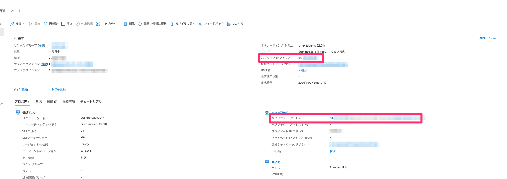
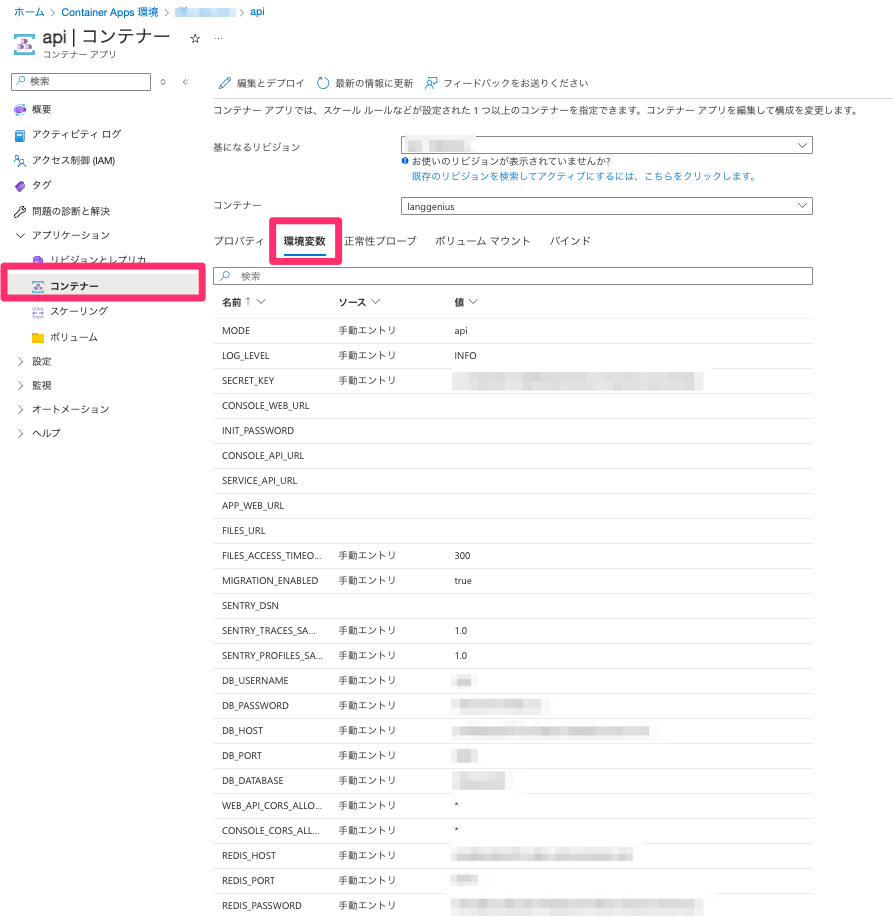

# Difyバージョンアップ方法

Difyのバージョンアップでは、PostgreSQLにマイグレーションがかかってしまうため、万が一切り戻す際にはPostgresSQLのバックアップを取得しておく必要があります。
このMarkdownでは、PostgreSQLのバックアップを取得する手順を記載しています。

## PostgreSQLのバックアップ

1. Azure Portalにログインし、仮想マシンからBastionホストのパブリックIPアドレスを確認します。


2. BastionホストにSSH接続します。事前に[download_sshkey.sh](scripts/download_sshkey.sh)を使ってBastionのSSH Keyをダウンロードしておく必要があります。

```bash
ssh -i  azureuser@<BastionホストのパブリックIPアドレス>
```



3. BastionからPostgreSQLサーバにpgdumpコマンドを実行します。各パラメーターはContainer AppsのAPIサービス->コンテナ->環境変数から確認することができます。



```bash
pg_dump -Fc -v  \
  --host=xxxxxxxxxxx.postgres.database.azure.com \
  --port=5432 \
  --username=xxxxxx \
  --dbname=difypgsqldb > backup.dump

> Password: xxxxxxxxx
```

4. バックアップファイルをローカルにダウンロードします。(任意)

```bash
scp -i <SSH Key> azureuser@<BastionホストのパブリックIPアドレス>:~/backup.dump .
```

## バージョンアップ

Terraform tfvarsから該当のvariableのイメージバージョンを変更します。

```terraform
variable "dify-api-image" {
  type = string
  default = "langgenius/dify-api:0.7.1"
}

variable "dify-sandbox-image" {
  type = string
  default = "langgenius/dify-sandbox:0.2.6"
}

variable "dify-web-image" {
  type = string
  default = "langgenius/dify-web:0.7.1"
}
```

## Terraform apply

README.mdの手順に従い、Terraform applyを実行します。

## リストア（切り戻し）

万が一、バージョンアップに失敗した場合は、PostgreSQLのバックアップファイルを使ってリストアを行います。
bastionへのログインまでの流れはバックアップ手順と同じため割愛します。
bastionへのログイン後、以下のコマンドを実行します。

```bash
pg_restore -v --clean --if-exists \
  --host=xxxxxxxx.postgres.database.azure.com \
  --port=5432 \
  --username=xxxxxxx \
  --dbname=difypgsqldb backup.dump
```
